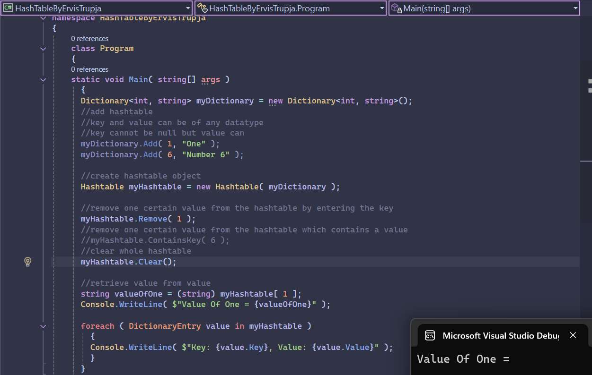

# Hashtable in C# – Example Project

This project demonstrates how to use a `Hashtable` in C#. It shows how to initialize a hashtable from a dictionary, remove entries, clear the hashtable, retrieve values, and iterate through all key-value pairs.

## 📸 Screenshot

